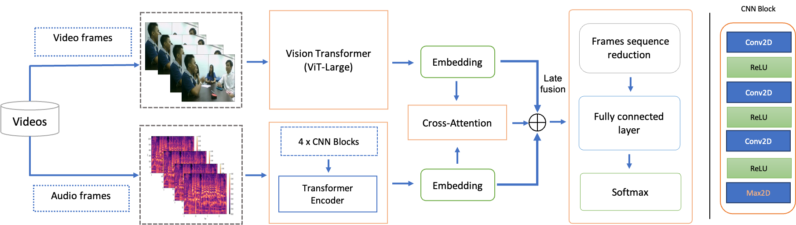

# EmotiW 2023 – Audio/Video Emotion Recognition (Cross-Attention Fusion)
## 🏆 EmotiW 2023 Winner

This repository contains my winning solution for the **EmotiW 2023** challenge (ACM ICMI 2023, Paris), for the **Audio-Visual Group-based Emotion Recognition** track.  

## Method Overview

<p align="center">
  
</p>


## 📄 Paper

**Multimodal group emotion recognition in-the-wild using privacy-compliant features** (ICMI 2023)

- arXiv: https://arxiv.org/abs/2312.05265
- HAL (PDF): https://hal.science/hal-04325815v1/file/MgEmoR-pcf-Emotiw2023.pdf
- ACM DL (DOI): https://dl.acm.org/doi/10.1145/3577190.3616546

---
The training pipeline uses precomputed tensors (.pt) for video frames and audio spectrogram frames.

It supports training emotion classifiers using:

- Audio only

- Video only

- Audio–Video fusion with Cross-Attention (query = audio, key/value = video)


## Repository structure
```bash emotiw2023/
  Emotiw-env.yml
  emotiw2023/
    models/
    data/
    training/
  scripts/
    train.py
```
## Envionment setup
```bash
conda env create -f Emotiw-env.yml
conda activate Emotiw-env

```

## Data format

The dataloader expects torch tensors (.pt) already saved on disk:

## Video tensors

- .../<Vid_name>.mp4.img.<NB_FRAMES_VIDEO>.pt

## Audio tensors

- .../<Vid_name>.mp4.spec.<NB_FRAMES_AUDIO>.pt

## Labels

Two text files (space-separated), typically:

- Train_labels.txt

- Val_labels.txt

with at least these columns:

- Vid_name

- Label (values: 1,2,3 → mapped internally to 0)

## Training 
### Main Entrypoin

```bash
python scripts/train.py --train_corpus fusion

```

## Key arguments
### Dataset path

You can set the parent directory once:

- --dir_data_parent /path/to/VGAF/

### Frames (temporal sampling)

You can train with:

- 5 audio frames and 5 video frames (fast)

- 5 audio frames and 75 video frames (higher temporal resolution)

- (optionally) 75 audio frames depending on your preprocessing setup

Examples:

- --nb_frames_audio 5 --nb_frames_video 75


### Classification head: average vs flatten

By default, the model uses temporal average pooling before classification.

To use flattening instead:

- --flatten

### Resume training

If training collapses, you can resume from the last saved checkpoint:

- --resume_from path/to/checkpoint.pt

If you are still using the legacy script style:

- --resume True and --start_epoch <value>

### GPU selection

Use a particular GPU:

- --device cuda:1


## Example commands
1) Train fusion (Cross-Attention), 5 audio frames + 75 video frames
```bash
python scripts/train.py \
  --train_corpus fusion \
  --dir_data_parent /Corpora/VGAF \
  --nb_frames_audio 5 \
  --nb_frames_video 75 \
  --batch_size 4 \
  --num_epochs 100 \
  --device cuda:0
  ```


  2) Train fusion with flatten head
```bash
python scripts/train.py \
  --train_corpus fusion \
  --dir_data_parent /Corpora/VGAF \
  --nb_frames_audio 5 \
  --nb_frames_video 75 \
  --flatten \
  --device cuda:0
  ```


  3) Train audio-only

  ```bash
python scripts/train.py \
  --train_corpus audio \
  --dir_data_parent /Corpora/VGAF \
  --nb_frames_audio 5 \
  --device cuda:0
  ```

4) Resume training from checkpoint

```bash
python scripts/train.py \
  --train_corpus fusion \
  --dir_data_parent /Corpora/VGAF \
  --resume_from runs/checkpoints/fusion_a5_v75_flatFalse_syn0/best.pt \
  --device cuda:0
  ```

### Logging (TensorBoard)

Training and validation metrics are logged to TensorBoard.
Example:
```bash
tensorboard --logdir runs/tb
```


### Synthetic  data generation

To generate synthetic video frames you can follow this example:
```bash
python scripts/generate_synthetic_frames.py \
  --bg_root /... \
  --faces_root /... \
  --out_dir /... \
  --label Positive \
  --videos_per_bg 200 \
  --frames_per_video 75 \
  --overwrite
```


## Citation

If you use this repository/code in your research, please cite:

```bibtex
@inproceedings{augusma2023multimodal,
  title={Multimodal group emotion recognition in-the-wild using privacy-compliant features},
  author={Augusma, Anderson and Vaufreydaz, Dominique and Letué, Frédérique},
  booktitle={Proceedings of the 25th International Conference on Multimodal Interaction},
  pages={750--754},
  year={2023}
}
```
## License
This project is licensed under the MIT License — see the LICENSE file for details.
